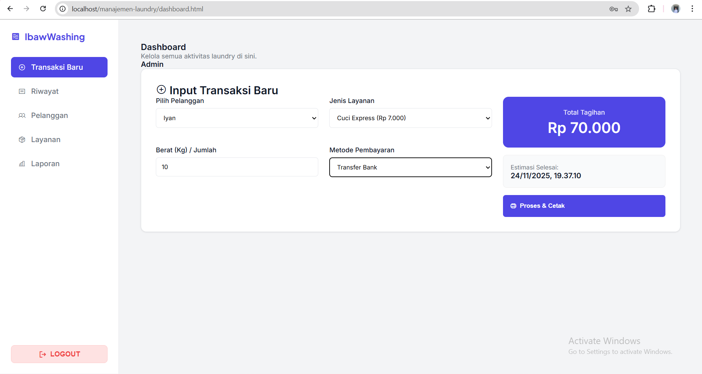

# Website Manajemen Transaksi Laundry - Kelompok 1

## 1. Nama Project
**Website Manajemen Transaksi Laundry**

## 2. Nama Kelompok & Anggota
**Kelompok 1**

| Nama Anggota | NIM | Jobdesk / Peran |
| :--- | :--- | :--- |
| **Dian Agus Saputra** | 701230019 | - |
| **David Ardi Nugraha** | 701230013 | - |
| **M. Iqbal** | 701230046 | - |
| **Nazarudin** | 701220274 | - |

## 3. Deskripsi Singkat Aplikasi
[cite_start]Website Manajemen Transaksi Laundry adalah aplikasi berbasis web yang dirancang untuk membantu pemilik usaha laundry dalam mengelola operasional prncucian[cite: 64]. [cite_start]Sistem ini mengintegrasikan pencatatan pesanan, pengelolaan data pelanggan, manajemen jenis layanan, hingga pembuatan struk dan laporan keuangan sederhana dalam satu platform digital[cite: 65].

## 4. Tujuan Sistem / Permasalahan yang Diselesaikan
Aplikasi ini dibangun dengan tujuan:
* [cite_start]**Efisiensi:** Menggantikan pencatatan manual menjadi digital untuk mengurangi risiko kehilangan data[cite: 66].
* [cite_start]**Akurasi:** Meminimalisir kesalahan perhitungan biaya transaksi dengan sistem hitung otomatis[cite: 66].
* [cite_start]**Dokumentasi:** Memastikan seluruh riwayat transaksi dan data pelanggan tersimpan rapi dan mudah dicari[cite: 44].
* [cite_start]**Pelayanan:** Mempercepat proses pelayanan dengan adanya fitur estimasi waktu selesai dan cetak struk otomatis[cite: 114].

## 5. Teknologi yang Digunakan
[cite_start]Aplikasi ini dikembangkan menggunakan arsitektur 3-tier (Presentation, Logical, Database Layer) [cite: 228] dengan teknologi berikut:
* [cite_start]**Bahasa Pemrograman (Backend):** PHP (Native) [cite: 228]
* [cite_start]**Basis Data:** MySQL [cite: 228]
* [cite_start]**Frontend:** HTML5, CSS3, JavaScript (Vanilla) [cite: 228]
* **Library Ikon:** Phosphor Icons
* **Server Environment:** Laragon

## 6. Cara Menjalankan Aplikasi

### a. Persiapan (Instalasi)
1.  Pastikan aplikasi **Laragon** sudah terinstall.
2.  Clone repository ini atau download folder project.
3.  Pindahkan folder project ke dalam direktori `www` di Laragon (biasanya di `C:/laragon/www/nama_folder_laundry`).

### b. Konfigurasi Database
1.  Buka aplikasi **Laragon** dan klik tombol **Start All**.
2.  Klik tombol **Database** untuk membuka HeidiSQL (atau akses phpMyAdmin jika sudah diinstall).
3.  Buat database baru dengan nama: `laundry_db` (sesuai konfigurasi di file `koneksi.php`).
4.  Import file database SQL yang disertakan dalam repository ini (misalnya `database.sql` atau `laundry_db.sql`) ke dalam database yang baru dibuat.

### c. Menjalankan Project
1.  Buka browser (Chrome/Edge).
2.  Jika fitur *Auto Virtual Hosts* Laragon aktif, akses: `http://nama_folder_laundry.test`.
3.  Atau akses menggunakan Localhost biasa: `http://localhost/nama_folder_laundry`.
4.  Halaman Login akan muncul.

## 7. Akun Demo
[cite_start]Gunakan kredensial berikut untuk masuk sebagai Admin[cite: 69]:
* **Username/Email:** `admin@laundry.com`
* **Password:** `12345`
*(Catatan: Pastikan data user ini sudah ada di tabel `users` pada database yang diimport)*.

## 8. Link Deployment & Demo
* **Link Deployment:** [Masukkan Link Hosting Jika Ada, atau tulis "-" jika localhost only]
* **Link Demo Video:** [Masukkan Link YouTube Video Demo Kamu Disini]

## 9. Screenshot Halaman Utama

*Tampilan Dashboard Utama*

## 10. Catatan Tambahan
Beberapa hal mengenai batasan sistem ini berdasarkan SRS:
* [cite_start]**Platform:** Aplikasi ini berbasis Web Desktop, belum tersedia versi Mobile (Android/iOS)[cite: 79].
* [cite_start]**Integrasi Hardware:** Sistem belum terintegrasi dengan Barcode Scanner atau Printer Thermal otomatis[cite: 81].
* [cite_start]**Online Booking:** Tidak ada fitur booking online oleh pelanggan; semua input dilakukan oleh Admin/Kasir[cite: 82].

## 11. Keterangan Tugas
Project ini ditujukan untuk memenuhi **Tugas Final Project Mata Kuliah Rekayasa Perangkat Lunak**.

* **Dosen Pengampu:** Ibu Dila Nurlaila, M.Kom
* [cite_start]**Program studi:** Sistem Informasi[cite: 6]
* [cite_start]**Fakultas:** Sains dan Teknologi [cite: 6]
* [cite_start]**Universitas:** UIN Sultan Thaha Saifuddin Jambi [cite: 7]